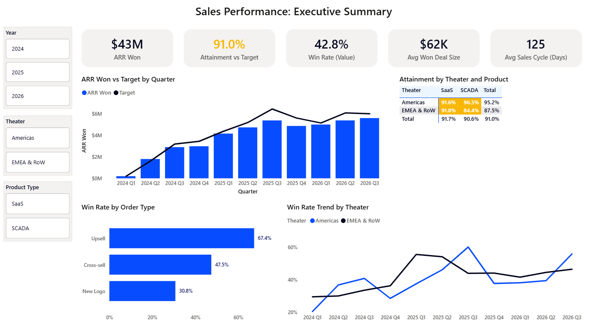
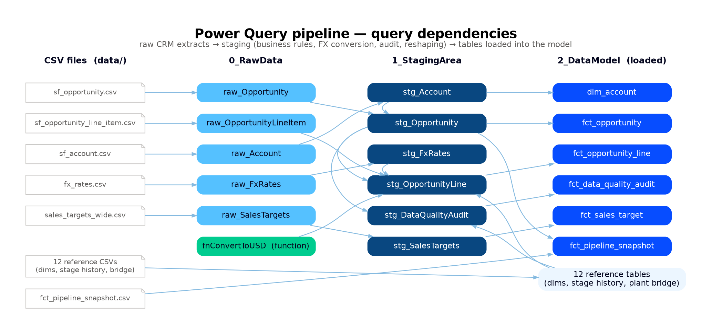
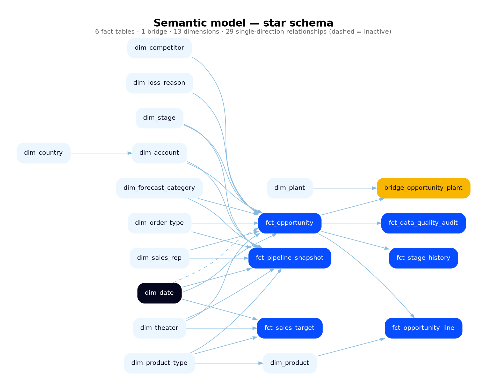
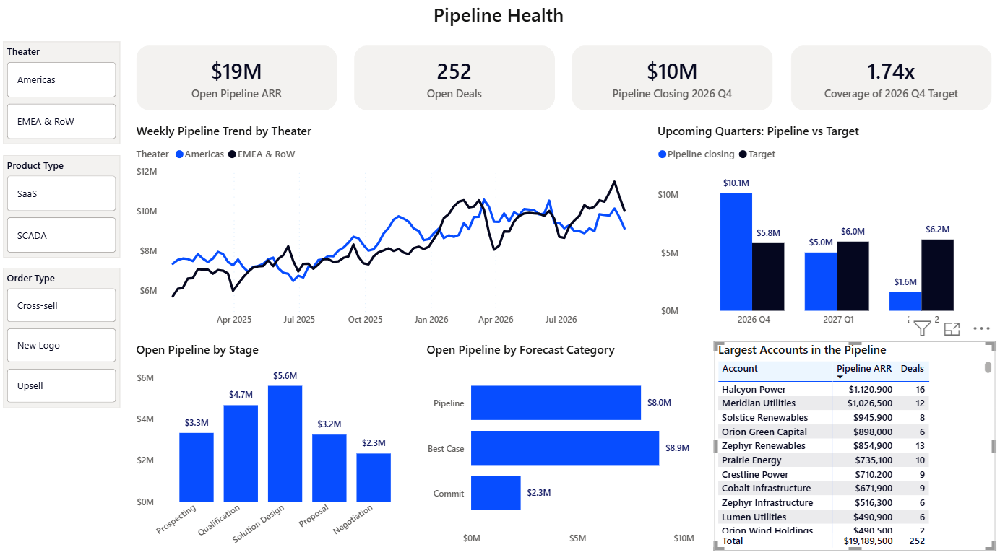
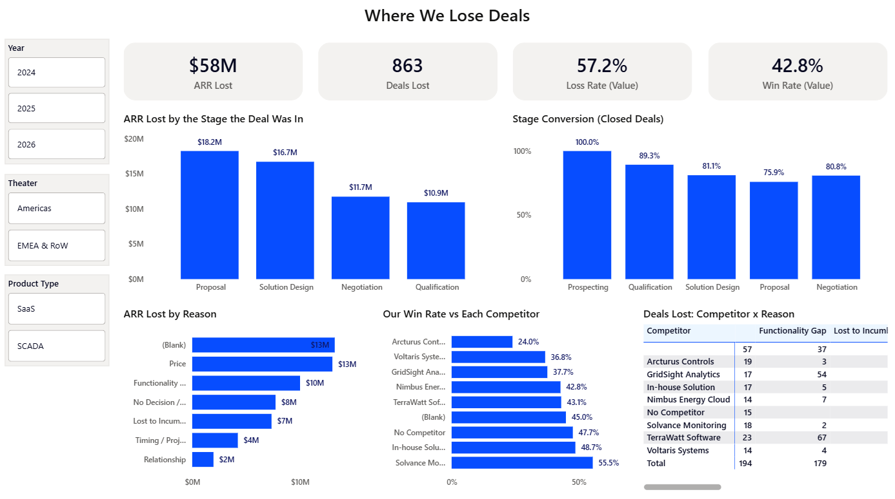
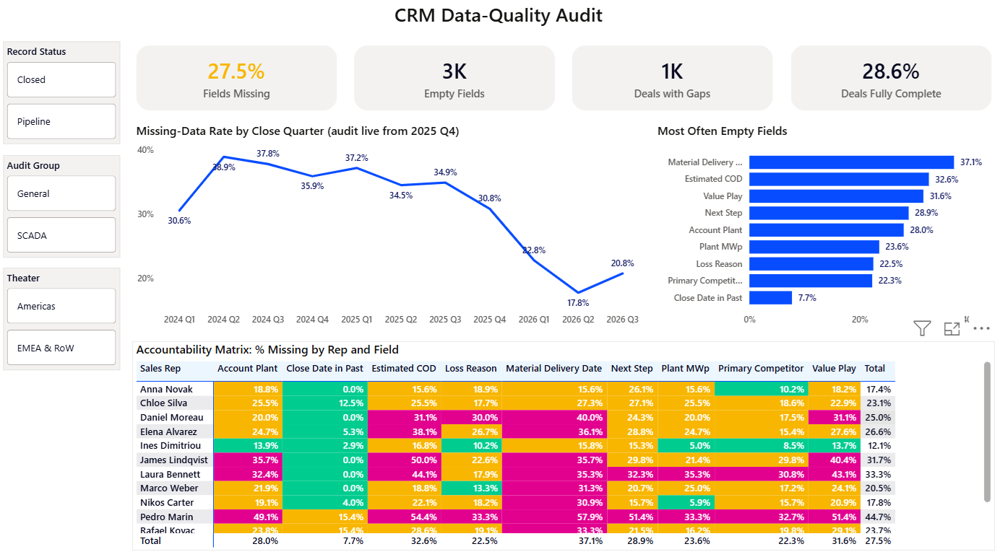

# Sales Performance Analytics — Power BI Case Study

End-to-end sales analytics on Salesforce - style CRM data:  
- a layered **Power Query (M) ETL pipeline**,
- a **star-schema semantic model with ~40 DAX measures**,
- and **four report pages** for sales leadership.

> This repository recreates, with **fully synthetic data**, analytics work I built as a Sales Operations Analyst
> at a B2B software company serving renewable-energy asset owners ("the Company"). No company data, code,
> names or figures are included; the data generator and all business rules here are my own reconstruction.



---

## The business problem

Sales Operations needed one trusted view of bookings, pipeline, win/loss and competitive performance across
two sales theaters (Americas, EMEA & RoW) and two product lines (SaaS monitoring software, SCADA plant controls).
Data lived in the CRM, quarterly targets were in finance spreadsheets, and reporting for the sales teams' quarter results
reviews was assembled through excel sheets.

## Impact of the original work

| | |
|---|---|
| **10 → 3 days** | preparation time for the quarterly results presentation to the sales teams |
| **−50%** | missing values in key CRM fields after the data-quality audit went live |
| **CRM redesign** | the analysis exposed gaps in how products and customer plants were recorded; the CRM data model was changed (product assignments, plant attributes) so sales gaps could be analysed by product and asset |
| **Process changes** | reports were used by Sales Operations to monitor KPIs and fine-tune sales processes |

---

## Architecture

```
 data/raw/*.csv                 Power Query (M)                                   Semantic model            Reports
 ─────────────────     ┌──────────────┬───────────────────┬──────────────┐     ─────────────────     ──────────────────
 Salesforce-style  ──► │  0_RawData   │   1_StagingArea   │ 2_DataModel  │ ──► Star schema       ──► Executive Summary
 extracts, FX rates,   │  as-is load  │ types, rules, FX, │ fct_* / dim_*│     29 relationships      Pipeline Health
 finance targets       │              │ audit, reshaping  │              │     ~40 DAX measures      Where We Lose Deals
                       └──────────────┴───────────────────┴──────────────┘                           CRM Data Quality
```



### 1. Power Query pipeline — [`powerquery/`](powerquery/)

Raw extracts are loaded untouched; all cleaning happens in connection-only staging queries; only the final
tables load into the model. Highlights:

- **Business-rule filtering** — duplicate losses, renewals and test accounts removed with null-safe,
  case-insensitive logic; CRM codes mapped to reporting names through a single mapping record.
- **Multi-currency ARR** — [`fnConvertToUSD`](powerquery/0_Functions/fnConvertToUSD.pq) converts six currencies
  with the rate valid on each deal's close date, read from an FX table with a validity period associated with each currency and
  directly translates to the close date of an opportunity.
- **Data-quality audit in M** — nine rule-based completeness checks per deal (extra rules for SCADA deals),
  unpivoted into a long table for the audit report.
- **Reshaping finance data** — a wide quarterly target sheet in kUSD unpivoted and split into theater and product type.
- **Portable** — one `DataFolder` parameter instead of hard-coded paths; explicit `en-US` culture for locale-safe refresh.

### 2. Semantic model



- **Star schema**: opportunity header and product-line facts (mirroring Salesforce), stage history, weekly pipeline
  snapshots, data-quality audit, sales targets, a many-to-many plant bridge, and conformed dimensions.
- **One marked calendar table** (Auto date/time off), all relationships single-direction; the pipeline snapshot is
  modelled as an independent fact to avoid a second date path.
- **~40 measures in 11 display folders**, each documented with a description.

DAX patterns worth a look:

```dax
-- Win rate that stays correct on any page: page-level stage filters are cleared first
ARR Won =
CALCULATE ( [ARR], REMOVEFILTERS ( dim_stage ), REMOVEFILTERS ( dim_forecast_category ),
            dim_stage[StageName] = "Closed Won" )

-- Pipeline coverage: current pipeline whose CLOSE date falls in the selected quarter, vs that quarter's target.
-- The date selection is moved from the snapshot date to the close date with TREATAS.
Pipeline ARR Closing in Period =
VAR PeriodDates   = VALUES ( dim_date[Date] )
VAR LastSnapshot  = CALCULATE ( MAX ( fct_pipeline_snapshot[SnapshotDate] ), REMOVEFILTERS ( dim_date ) )
RETURN
    CALCULATE ( SUM ( fct_pipeline_snapshot[ARR_USD] ), REMOVEFILTERS ( dim_date ),
                fct_pipeline_snapshot[SnapshotDate] = LastSnapshot,
                TREATAS ( PeriodDates, fct_pipeline_snapshot[CloseDate] ) )

-- Losses traced back to the stage the deal was in, via stage history
ARR Lost at Stage =
VAR LostDeals = CALCULATETABLE ( VALUES ( fct_stage_history[OpportunityId] ),
                                 fct_stage_history[ToStage] = "Closed Lost" )
RETURN CALCULATE ( [ARR], TREATAS ( LostDeals, fct_opportunity[OpportunityId] ) )

-- Plant capacity through a many-to-many bridge, counting each plant once
Plant MWp =
CALCULATE ( SUM ( dim_plant[PlantMWp] ),
            CROSSFILTER ( bridge_opportunity_plant[PlantId], dim_plant[PlantId], BOTH ) )
```

Also included: attainment vs targets of started quarters only, stage conversion from stage history and traffic-light colour measures used
for conditional formatting.

### 3. Report pages

| Page | Questions it answers |
|---|---|
| **Executive Summary** | ARR won vs target by quarter; attainment by theater × product; win rate by order type and over time |
| **Pipeline Health** | Open pipeline today and its weekly trend; coverage of upcoming quarters' targets; pipeline by stage and forecast category |
| **Where We Lose Deals** | ARR lost by the stage deals were in; stage conversion; loss reasons; win rate against each competitor |
| **CRM Data Quality** | Missing-data rate over time (before/after the audit); most often empty fields; rep × field accountability matrix |

| | |
|---|---|
|  |  |
|  |  |  

**Drill Through Page:** The opportunity detail page is hidden from navigation and reached only by drill-through, so summary pages stay clean while users can
still get from a KPI to the underlying deals in one click.

---

## Synthetic data 

`The data is fictional. Data was generated with the help of an AI assistant, shaped like a typical Salesforce CRM export,  
the techniques I have been working are demonstrated without using any company data.

---

## Lessons Learned

The original model grew over many iterations (57 tables including 16 auto-generated date tables, 250+ measures). Rebuilding it cleanly, we changed:

- **Auto date/time off** — the original carried 16 hidden auto-generated date tables; here one marked calendar serves every fact.
- **Fewer, slice-able measures** — region- and product-specific measure variants replaced by single measures sliced by dimensions.
- **Single-direction relationships** — cross-filtering only where needed, inside the measure (`CROSSFILTER`, `TREATAS`).
- **FX rates as data** — rates in a table instead of hard-coded in the conversion/loading M function.

---

## Run it yourself

1. Download the repo from the green "CODE" button as a zip folder.
2. Unzip the file into "C:\gh\PowerBI-sales-performance-analytics-main\".
3. Run "ModelandReports.pbip"
4. Press "Refresh" to read the csv files again and fill the tables.

## Repository structure

```
├── data/
│   ├── raw/                  Salesforce-style extracts (Power Query 0_RawData)
│   ├── validation/           clean tables that staging must reproduce (tests only)
│   └── *.csv                 reference tables loaded directly
├── docs/                     data dictionary, screenshots
├── powerbi/                  Power BI project (PBIP: TMDL model + PBIR report)
├── powerquery/               every M query as a .pq file, by layer

```

## Tools

Power BI Desktop (PBIP / PBIX) · Power Query (M) · DAX · Python (pandas, NumPy)

---

*Katerina Psallida — [kpsalida.github.io](https://kpsalida.github.io)*
